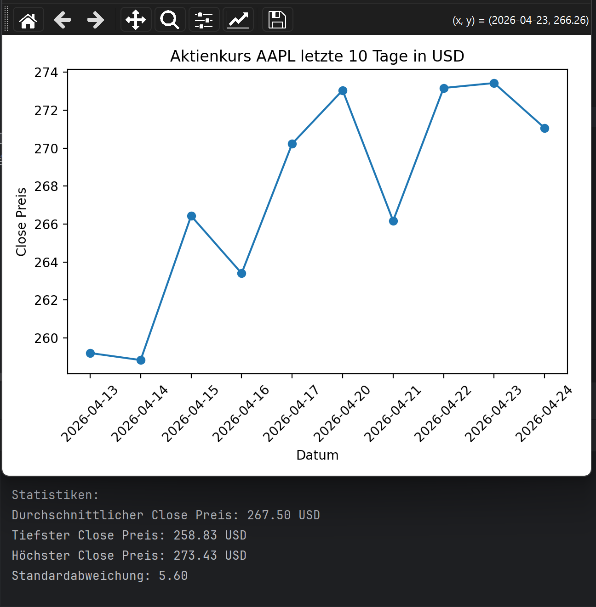

This project fetches stock market data from an external API and processes it using Python.  
The data is then visualized with pandas and matplotlib to display stock price trends.  
To reduce unnecessary API calls, the data is only fetched via GET if no JSON cache file exists or if the existing cache is older than 10 minutes.
